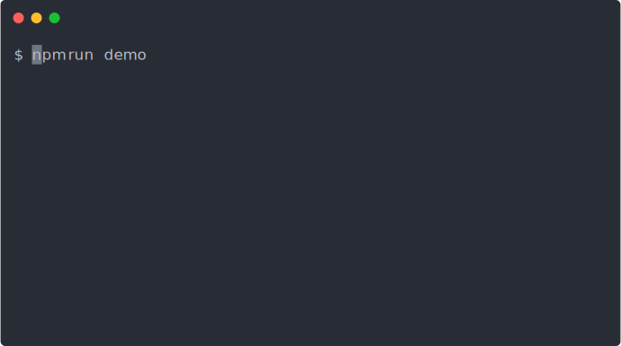
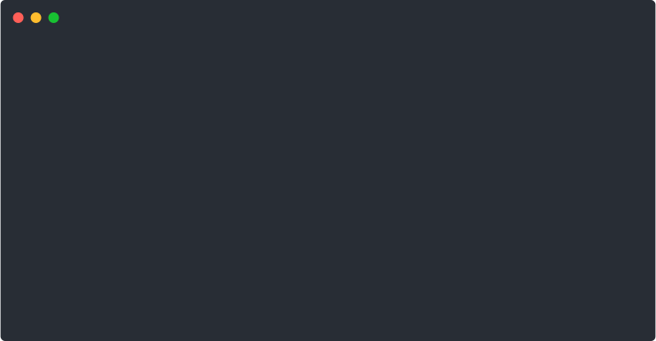

# ink-tab

> Tab component for [Ink](https://github.com/vadimdemedes/ink).

## Demo



## Installation

```sh
npm install ink-tab
```

or with yarn

```
yarn add ink-tab
```

## Usage

```js
import React, { Component } from 'react';
import { render, Box, Color } from 'ink';
import { Tabs, Tab } from 'ink-tab';

class TabExample extends Component {
  constructor(props) {
    super(props);

    this.state = {
      activeTabName: null,
    };

    this.handleTabChange = this.handleTabChange.bind(this);
  }

  handleTabChange(name, activeTab) {
    this.setState({
      activeTabName: name,
    });
  }

  render() {
    return (
      <Box flexDirection="column">
        <Box>
          {this.state.activeTab === 'foo' && 'Selected tab is "foo"'}
          {this.state.activeTab === 'bar' && 'Selected tab is "bar"'}
          {this.state.activeTab === 'baz' && 'Selected tab is "baz"'}
        </Box>

        <Tabs onChange={this.handleTabChange}>
          <Tab name="foo">Foo</Tab>
          <Tab name="bar">Bar</Tab>
          <Tab name="baz">Baz</Tab>
        </Tabs>
      </Box>
    );
  }
}

render(TabExample);
```

### Props

#### Tabs component

##### childrens

`Tabs` must only containt `Tab` children

##### onChange

Type: `Function`

Parameters:

- `name`: the name specified in the `name` prop
- `activeTab`: the current active tab component

`onChange` function is called on component start and on every changes in tabs

##### keyMap

The default keyMap is the following:

- use left / right or up / down to move to previous / next tab (depending if you use column or row direction),
- use shift+tab / tab to move to previous / next tab,
- use meta (alt) + 1-9 number to go to selected tab.

You can override it this way:

```js
<Tabs keyMap={{
    useTab: false,
    useNumbers: false,
    previous: ['h', 'j'],
    next: ['k', 'l'],
}}>
```

##### flexDirection

The `<Tabs>` component pass every props given to the containing `<Box>` of the tabs. This way you can easily build a vertical tabs component by using `<Tabs flexDirection="column">`.



##### width

If you specify a `width` to `<Tabs flexDirection="column"`, the width will be used to force the separator width.

#### Tab component

##### name

Type: `string`
the name that will be returned in the `onChange` function

## Who is using `ink-tab` ?

I created `ink-tab` at first to use in [changelog-view](https://github.com/jdeniau/changelog-view), a small cli to help you read what did change in your dependencies since your current version, reading CHANGELOG.md, HISTORY.md, github releases, etc.

If you use it in a component, feel free to tell me, I will be pleased !

## Hacking

Issues and pull requests are welcome.

You can run the demo script by running `yarn demo` or `npm run demo`
