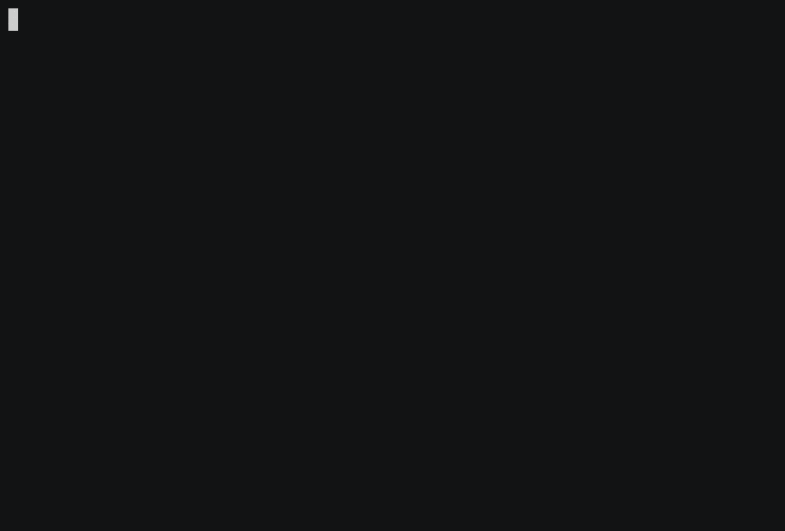

# ink-tab

> Tab component for [Ink](https://github.com/vadimdemedes/ink).

## Demo



## Installation

```sh
npm install ink-tab
```

or with yarn

```
yarn add ink-tab
```

## Usage

```js
import { h, render, Component, Text } from 'ink';
import { Tabs, Tab } from 'ink-tab';

class TabExample extends Component {
  constructor(props) {
    super(props);

    this.state = {
      activeTabName: null,
    };

    this.handleTabChange = this.handleTabChange.bind(this);
  }

  handleTabChange(name, activeTab) {
    this.setState({
      activeTabName: name,
    });
  }

  render() {
    return (
      <div>
        <div>
          {this.state.activeTabName === 'foo' && (
            <Text>Selected tab is "foo"</Text>
          )}
          {this.state.activeTabName === 'bar' && (
            <Text>Selected tab is "bar"</Text>
          )}
          {this.state.activeTabName === 'baz' && (
            <Text>Selected tab is "baz"</Text>
          )}
        </div>

        <Tabs onChange={this.handleTabChange}>
          <Tab name="foo">Foo</Tab>
          <Tab name="bar">Bar</Tab>
          <Tab name="baz">Baz</Tab>
        </Tabs>
      </div>
    );
  }
}

render(TabExample);
```

### Props

#### Tabs component

##### childrens

`Tabs` must only containt `Tab` children

##### onChange

Type: `Function`

Parameters:

* `name`: the name specified in the `name` prop
* `activeTab`: the current active tab component

`onChange` function is called on component start and on every changes in tabs

#### Tab component

##### name

Type: `string`
the name that will be returned in the `onChange` function

## Hacking

Issues and pull requests are welcome.

You can run the demo script by running `yarn demo` or `npm run demo`
